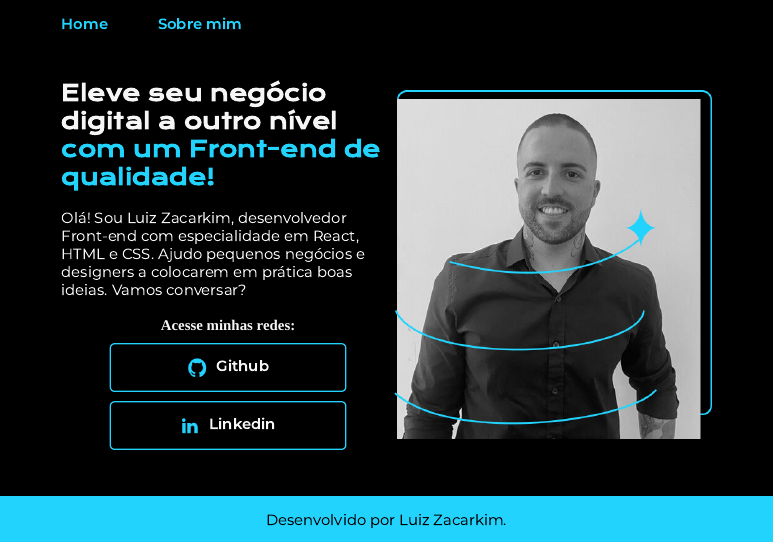

# Portfólio - Projeto Alura Front-End

Este é o repositório do meu primeiro portfólio web, desenvolvido como projeto prático durante o curso de **HTML e CSS** da [Alura](https://www.alura.com.br/). O objetivo foi criar uma página de apresentação pessoal, aplicando os conceitos fundamentais de desenvolvimento front-end.

## 🚀 Visualização do Projeto

Abaixo, uma captura de tela da página inicial do projeto:



## 📋 Índice

- [Sobre o Projeto](#-sobre-o-projeto)
- [Funcionalidades](#-funcionalidades)
- [Tecnologias Utilizadas](#-tecnologias-utilizadas)
- [Estrutura de Arquivos](#-estrutura-de-arquivos)
- [Como Executar](#-como-executar)
- [Autor](#-autor)

## 📖 Sobre o Projeto

O projeto consiste em um site estático de duas páginas: "Home" e "Sobre mim". A página principal serve como uma vitrine, apresentando uma breve introdução e links para minhas redes profissionais. A segunda página é dedicada a uma descrição mais detalhada sobre minha trajetória (atualmente com texto placeholder).

O layout foi construído utilizando Flexbox para garantir um alinhamento moderno e eficiente dos elementos.

## ✨ Funcionalidades

- **Página Inicial:** Contém um título de impacto, um parágrafo de apresentação e botões que direcionam para o GitHub e LinkedIn.
- **Página Sobre Mim:** Uma seção dedicada para uma biografia mais completa.
- **Links Externos:** Os links para as redes sociais abrem em uma nova aba do navegador para não interromper a navegação no portfólio.
- **Estilização com CSS:** O design segue uma paleta de cores moderna (preto, branco e ciano) e utiliza fontes customizadas do Google Fonts para uma melhor identidade visual.

## 💻 Tecnologias Utilizadas

O projeto foi desenvolvido com as seguintes tecnologias:

- **HTML5:** Para a estruturação semântica do conteúdo.
- **CSS3:** Para a estilização, layout (Flexbox) e design geral.
- **Google Fonts:** Para a importação das fontes `Krona One` e `Montserrat`.

## 📂 Estrutura de Arquivos

O projeto está organizado da seguinte forma para facilitar a manutenção e escalabilidade:

PORTFOLIO/
├── css/
│   └── style.css
├── img/
│   ├── Logo Github.png
│   ├── Logo linkedin.png
│   └── perfil.png
├── index.html
├── about.html
└── readme.md


## ▶️ Como Executar

Para visualizar o projeto em sua máquina local, siga os passos abaixo:

1.  **Clone o repositório (substitua com o link do seu repositório):**
    ```sh
    git clone [https://github.com/lfzacarkims/alura-front-end-portfolio.git](https://github.com/lfzacarkims/alura-front-end-portfolio.git)
    ```
2.  **Navegue até o diretório do projeto:**
    ```sh
    cd alura-front-end-portfolio
    ```
3.  **Abra o arquivo `index.html` no seu navegador de preferência.**

## 👨‍💻 Autor

Desenvolvido por **Luiz Zacarkim**.

- GitHub: [@lfzacarkims](https://www.github.com/lfzacarkims)
- LinkedIn: [Luiz Zacarkim](https://www.linkedin.com/in/zacarkim/)